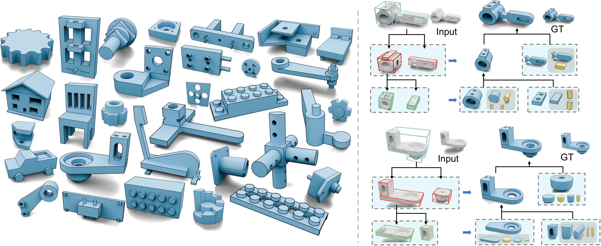

# CADRec

### Reconstructing a CAD Sequence Recursively with Localized Geometric Contexts

**SIGGRAPH Asia 2026 · ACM Transactions on Graphics**

Haoxuan Song, Bingchen Yang, Jun Xiao, Haiyong Jiang

**[Project Page](https://shinodashx.github.io/CADRec/)** · **[Paper (PDF)](https://shinodashx.github.io/CADRec/files/CADRec.pdf)** · **[Video](https://shinodashx.github.io/CADRec/#overview)**

CADRec reconstructs editable CAD sequences from point clouds through recursive part decomposition, localized geometric contexts, and local CADQuery program synthesis.

[](https://shinodashx.github.io/CADRec/)

Core training and layered recursive testing code for the CADRec grounding + contrastive learning experiment.

## Main files

- `cadgen_config.yaml`: training configuration with contrastive learning and bbox grounding enabled.
- `train.py`, `train.sh`, `traincadgen0311.py`: training entrypoints.
- `cadgen0311.py`: model, collate, contrastive loss, and bbox grounding logic.
- `cadgendataset0311.py`: CAD dataset and sampling utilities.
- `test_layer.py`, `recursive_bbox_infer0311.py`, `example1.py`: layered recursive inference and testing utilities.
- `yaml_config0311.py`: YAML configuration loading and snapshot helpers.

## Project website

The project page lives in [`docs/`](docs/) and uses plain HTML, CSS, and JavaScript, with no build step or third-party runtime dependencies. GitHub Pages serves the `main` branch's `/docs` directory.

To preview locally, run `python3 -m http.server 8080 --directory docs` and open the local server in your browser. Edit `docs/index.html` for paper content, `docs/style.css` for styling, and `docs/script.js` for the accessible result tabs and citation-copy interaction. Video and optimized figures are in `docs/assets/`; the paper and full-resolution figures are in `docs/files/`.

The paper PDF is compiled from the provided camera-ready LaTeX sources using the current `acmart` class, with duplicated post-preamble publication declarations removed for compilation. Research content is unchanged. Figure previews come from the supplied PDFs; the pipeline uses the paper's final figure. The two supplied video files are identical, so the site includes one copy with English captions.

## Citation

```bibtex
@article{song2026cadrec,
  title = {CADRec: Reconstructing a CAD Sequence Recursively with Localized Geometric Contexts},
  author = {Song, Haoxuan and Yang, Bingchen and Xiao, Jun and Jiang, Haiyong},
  journal = {ACM Transactions on Graphics},
  volume = {45},
  number = {6},
  articleno = {212},
  year = {2026},
  month = dec,
  doi = {10.1145/3842561}
}
```
